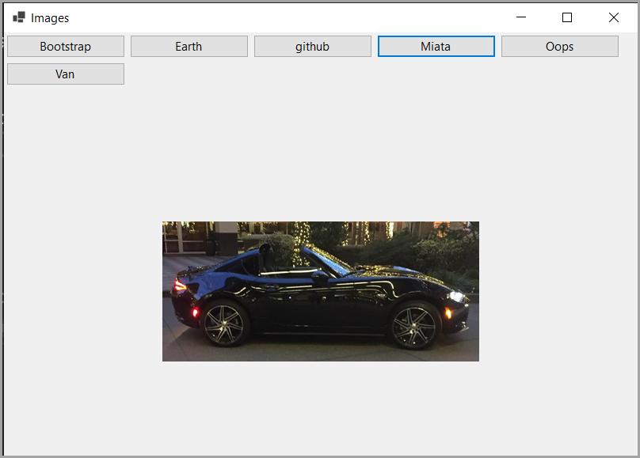

# About

Shows how to read images from a SQL-Server database table then create dynamic buttons to display the images.

Code ported from the following [repository](https://github.com/karenpayneoregon/sql-server-images) which may be of interest.
