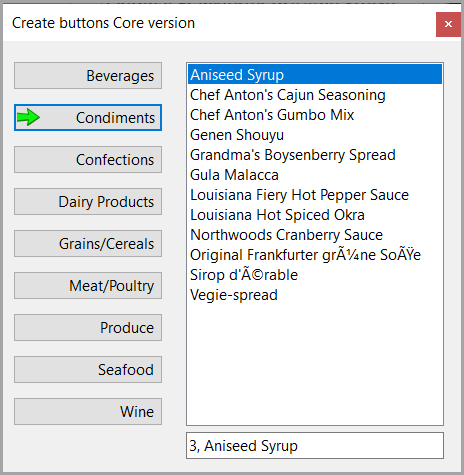
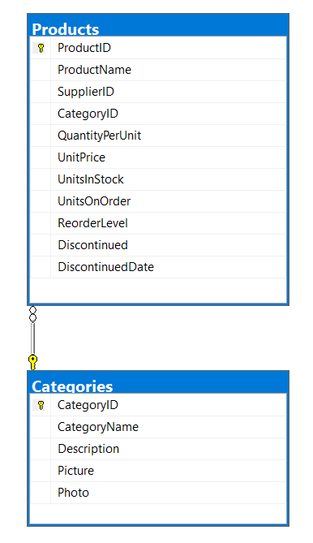

# Dynamic buttons

Code sample that creates one button for each category from NorthWind database table. Click a category button to get products for that category.

## Screen shot

There are several images for buttons in the project resources.



## Schema



## Requires

- Microsoft Visual Studio 2022 or higher
- NET 8

## Data Operations

[Dapper](https://www.nuget.org/packages/Dapper/2.1.28?_src=template)

## Logging

[SeriLog](https://www.nuget.org/packages/Serilog/3.1.1?_src=template)

## Custom button

Identifier property is used to store category identifier rather than using the tag propery.

```csharp
public class DataButton : Button
{
    [Category("Behavior"), Description("Identifier")]
    public int Identifier { get; set; }
    [Category("Behavior"), Description("Stash")]
    public string Stash { get; set; }
}
```

